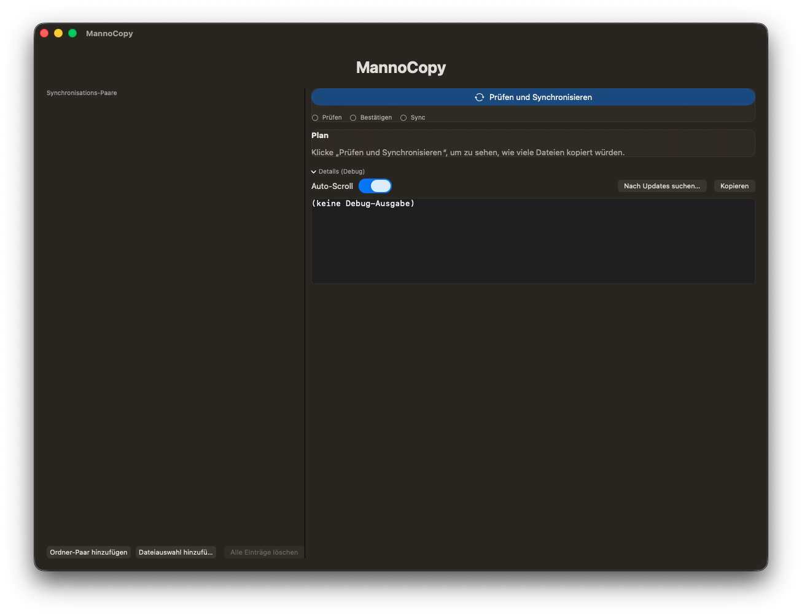

# MannoCopy

A small macOS app that helps you run safe `rsync` synchronizations with a clear workflow:
**Plan (dry-run) → Confirm → Sync**, plus live progress, logs, and a Stop button.

> 🇩🇪 German documentation: **[README.de.md](README.de.md)**  
> The app UI is currently **German**.

---

## Features

- Manage multiple sync pairs (folder-to-folder or selected files)
- Always creates a **plan** first (dry-run)
- Confirmation dialog before the real sync starts
- Live progress with smoothed speed and ETA estimation
- Clear run phases (planning / waiting for confirmation / syncing)
- **Safe Stop** button (cleanly terminates running `rsync` processes)
- Built-in update mechanism (Sparkle)
- Debug log view with copy-to-clipboard

---

## Requirements

- macOS (Apple Silicon or Intel)
- `rsync` available on the system  
  - Uses system `rsync` or Homebrew `rsync` if installed

## System Requirements

- macOS **Sequoia (15.6)** or later
- Xcode **16** or later (for building from source)
- `rsync` available on the system
---

## How it works (high level)

1. Press **“Prüfen und Synchronisieren”** to generate a plan (dry-run)
2. Review the calculated file count / bytes
3. Confirm to start the real synchronization

---

## Safety notes

This tool can copy / overwrite files depending on your settings and `rsync` behavior.
Always double-check your source/target folders and keep backups.

> Note: The user interface is currently available in **German only**.
---

## License

MIT — see **[LICENSE](LICENSE)**.

---

## Disclaimer

This software is provided **"as is"**, without warranty of any kind.
You are responsible for verifying your backup/sync configuration and results.
